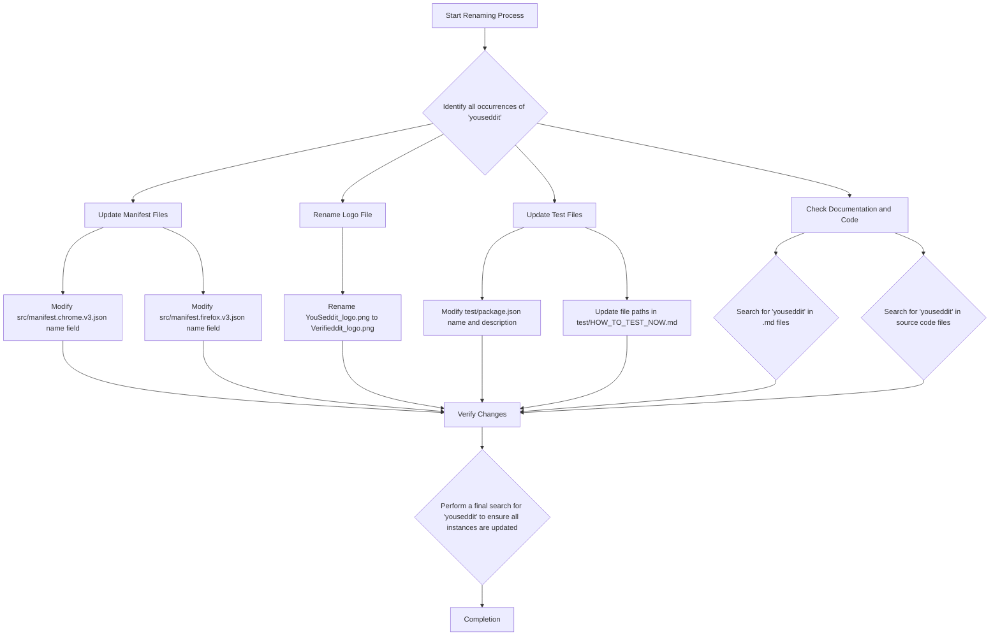

# Plan for Renaming Extension to "verifieddit"

This document outlines the steps required to rename the browser extension from "youseddit" to "verifieddit".

## Identified Occurrences of Current Name

Based on initial analysis and searches, the following locations contain the current extension name ("youseddit" or "check-youseddit") and need to be updated:

1.  [`src/manifest.chrome.v3.json`](src/manifest.chrome.v3.json): The `name` field.
2.  [`src/manifest.firefox.v3.json`](src/manifest.firefox.v3.json): The `name` field.
3.  [`YouSeddit_logo.png`](YouSeddit_logo.png): The file name itself.
4.  [`test/package.json`](test/package.json): The `name` and `description` fields.
5.  [`test/HOW_TO_TEST_NOW.md`](test/HOW_TO_TEST_NOW.md): File paths mentioned.

## Renaming Plan

## Detailed Steps

1.  **Update Manifest Files:**
    *   Modify the `name` field in [`src/manifest.chrome.v3.json`](src/manifest.chrome.v3.json) from "check-youseddit" to "verifieddit".
    *   Modify the `name` field in [`src/manifest.firefox.v3.json`](src/manifest.firefox.v3.json) from "check-youseddit" to "verifieddit".

2.  **Rename Logo File:**
    *   Rename the file [`YouSeddit_logo.png`](YouSeddit_logo.png) to `Verifieddit_logo.png`.
    *   Update any references to the old logo file name in the code or documentation.

3.  **Update Test Files:**
    *   In [`test/package.json`](test/package.json), change the `name` field from "check-youseddit-uat-server" to "verifieddit-uat-server" and the `description` field to reflect the new name.
    *   In [`test/HOW_TO_TEST_NOW.md`](test/HOW_TO_TEST_NOW.md), update the file paths that contain "youseddit-extension-validator" to "verifieddit-extension-validator".

4.  **Check Documentation and Code:**
    *   Perform a targeted search for "youseddit" or "check-youseddit" in all markdown files (`*.md`) to ensure no mentions were missed.
    *   Perform a targeted search for "youseddit" or "check-youseddit" in source code files (`*.ts`, `*.js`, etc.) to ensure no hardcoded strings or comments were missed.

5.  **Verify Changes:**
    *   After making all the changes, perform a final, comprehensive search across the entire project for "youseddit" (case-insensitive) to confirm that all instances have been successfully updated to "verifieddit".